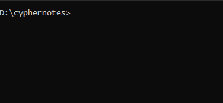

A dotnet CLI password management app.

Use it to encrypt any text data you want to store, or share securely.




## Solution Projects

### AESLib 

This class library project contains a class with static functions that wrap an implementation of the AES encryption algorithm.

### AESLibTests

Unit test project for AESLib.

### CypherCLI.Fs

The main application implemented as an F# CLI project.


[//]: # (## Encryption)

[//]: # ()
[//]: # (Provide the `-e` or `--encrypt` flag to enable encryption mode.)

[//]: # ()
[//]: # (```shell)

[//]: # (> dotnet run file -k mySecretKey --path path/to/my/note.txt -e -o ./output/cipher.txt)

[//]: # (```)

[//]: # (The `cipher.txt` file can now be shared with anyone. If they input the right key, they can decrypt the cipher.)

[//]: # ()
[//]: # (## Decryption)

[//]: # ()
[//]: # (When the `-e` flag is not provided, the default mode is decryption.)

[//]: # ()
[//]: # (```shell)

[//]: # (> dotnet run file -key mySecretKey --path path/to/my/cipher.txt -o ./output/plain.txt)

[//]: # (```)

[//]: # ()
[//]: # (## Running and Building the cli app on your system)

[//]: # ()
[//]: # (You can use this repo to build the application from source.)

[//]: # ()
[//]: # (First, clone this repo and make sure to have `dotnet` cli tool installed with version `net5.0`.)

[//]: # ()
[//]: # (Then you can run the following commands to generate a sharable, standalone executable for your platform)

[//]: # (that doesn't require the user to have the dotnet runtime on their system.)

[//]: # ()
[//]: # (The `-r` flag specifies the target to build for. More information at https://docs.microsoft.com/en-us/dotnet/core/rid-catalog.)

[//]: # (The `\p:PublishTrimmed=true` parameter allows trimming the artifact from all unneeded .net libraries.)

[//]: # ()
[//]: # (For sharing with Linux users)

[//]: # (```shell)

[//]: # (❯ dotnet publish -r linux-x64 -c Release /p:PublishSingleFile=true /p:PublishTrimmed=true /p:IncludeNativeLibrariesForSelfExtract=true)

[//]: # (```)

[//]: # ()
[//]: # (For sharing with Windows users)

[//]: # (```shell)

[//]: # (❯ dotnet publish -r win-x64 -c Release /p:PublishSingleFile=true /p:PublishTrimmed=true /p:IncludeNativeLibrariesForSelfExtract=true)

[//]: # (```)